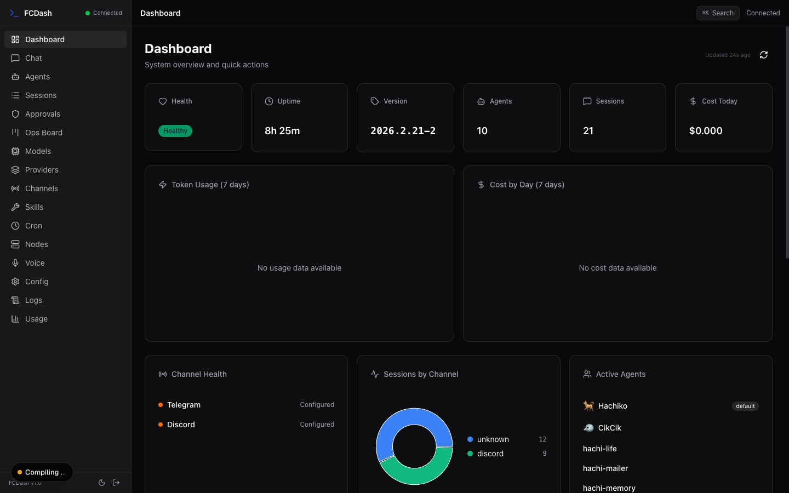
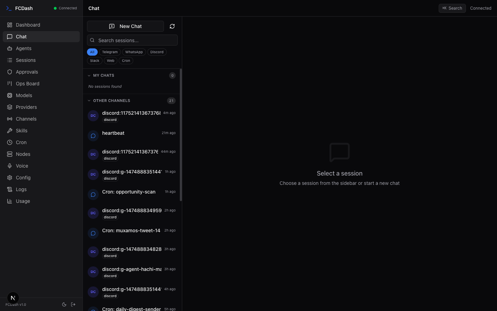

# FCDash

Full Control Dashboard for [OpenClaw](https://github.com/nicepkg/openclaw) — a real-time web interface to monitor and manage your OpenClaw gateway, agents, sessions, channels, and more.



## Features

- **Real-time dashboard** — health, uptime, usage charts, agent status at a glance
- **Chat interface** — send messages, view streaming responses, manage sessions across all channels
- **Agent management** — create, configure, and monitor AI agents
- **Multi-channel support** — Telegram, Discord, WhatsApp, Slack, Web
- **Session browser** — search, filter, pin, and inspect conversation history
- **Execution approvals** — review and approve/deny agent tool calls
- **Ops board** — kanban-style task management
- **Model explorer** — browse available LLM models and providers
- **Skill management** — install and configure agent skills
- **Cron scheduler** — manage scheduled tasks
- **Node management** — pair and monitor distributed nodes
- **Voice controls** — TTS configuration and voice wake settings
- **Live logs** — tail server logs in real-time
- **Usage analytics** — token counts, costs, per-model breakdowns
- **Command palette** — quick navigation with `Cmd+K`
- **Tailscale SSO** — automatic authentication for Tailscale users



## Tech Stack

| Layer | Technology |
|-------|-----------|
| Framework | [Next.js 16](https://nextjs.org/) (App Router, Turbopack) |
| UI | [React 19](https://react.dev/) |
| Styling | [Tailwind CSS v4](https://tailwindcss.com/) + [shadcn/ui](https://ui.shadcn.com/) |
| State | [Zustand 5](https://zustand.docs.pmnd.rs/) |
| Charts | [Recharts](https://recharts.org/) |
| Animations | [Framer Motion](https://www.framer.com/motion/) |
| Icons | [Lucide](https://lucide.dev/) |
| Drag & Drop | [dnd kit](https://dndkit.com/) |
| Markdown | [react-markdown](https://github.com/remarkjs/react-markdown) + syntax highlighting |

## Prerequisites

- **Node.js** 20+
- **OpenClaw gateway** running and accessible (default: `wss://localhost:28643`)
- A valid gateway token (generated during OpenClaw setup)

## Quick Start

```bash
# Clone
git clone https://github.com/nicepkg/openclaw-dashboard.git
cd openclaw-dashboard

# Install dependencies
npm install

# Configure
cp .env.example .env.local
# Edit .env.local with your gateway URL and token

# Run development server
npm run dev
```

Open [http://localhost:3000](http://localhost:3000) in your browser.

## Configuration

Copy `.env.example` to `.env.local` and fill in your values:

```env
# Gateway WebSocket URL
OPENCLAW_GATEWAY_URL=wss://localhost:28643

# Gateway token (from openclaw CLI setup)
OPENCLAW_GATEWAY_TOKEN=your-token-here

# Device identity (auto-generated by openclaw CLI)
OPENCLAW_DEVICE_ID=
OPENCLAW_DEVICE_TOKEN=

# Allow self-signed TLS certs for localhost gateway
NODE_TLS_REJECT_UNAUTHORIZED=0
```

> **Note:** Device identity fields are optional. If present, FCDash uses Ed25519 challenge-response authentication. Otherwise, it falls back to token-based auth.

## Architecture

```
Browser                          Server (Next.js)                OpenClaw Gateway
┌─────────────┐                 ┌──────────────────┐            ┌──────────────┐
│             │  EventSource    │                  │  WebSocket  │              │
│  React UI   │◄────────────────│  /api/events/gw  │◄───────────│   Gateway    │
│             │  (SSE)          │                  │  (events)   │   Server     │
│             │                 │                  │             │              │
│  ApiClient  │────POST────────►│  /api/rpc        │────RPC─────►│   91 RPC     │
│             │  (fetch)        │                  │  (ws)       │   Methods    │
└─────────────┘                 └──────────────────┘            └──────────────┘
```

**This is a full-stack application**, not just a frontend. The Next.js server maintains a persistent WebSocket connection to the OpenClaw gateway and exposes two HTTP endpoints that any client can consume:

| Endpoint | Method | Description |
|----------|--------|-------------|
| `/api/rpc` | POST | JSON-RPC proxy — 37 whitelisted methods (chat, agents, sessions, etc.) |
| `/api/events/gateway` | GET | SSE stream — real-time events (chat messages, health, approvals, etc.) |
| `/api/health` | GET | Connection status and gateway info |

This means you can build **any client** on top of FCDash's API — a macOS menu bar app, a mobile app, a CLI tool, or a custom integration. The bundled React UI is just one consumer of these endpoints.

**Why this architecture?**
- Gateway runs on a private network (often behind Tailscale)
- Browser can't directly connect to the gateway WebSocket
- Next.js server acts as an authenticated proxy with rate limiting
- SSE provides reliable real-time updates with auto-reconnection
- Any HTTP client can use the API (not limited to the bundled web UI)

### Key Directories

```
app/                  Pages (Next.js App Router)
  api/                API routes (RPC proxy, SSE, health)
  login/              Token-based login page
components/
  chat/               Chat UI components
  layout/             Shell, sidebar, header
  ops/                Kanban board components
  shared/             Reusable components
  ui/                 shadcn/ui primitives
hooks/                Custom React hooks
lib/
  server/             Server-only code (gateway singleton, auth, SSE, rate limiting)
  gateway-client.ts   WebSocket client for OpenClaw protocol
  types.ts            Full gateway protocol type definitions (91 RPC methods)
stores/               Zustand state stores
scripts/              Production startup script
```

## Production

```bash
# Build
npm run build

# Start
npm start

# Or use the production script (waits for gateway, auto-builds)
./scripts/start-production.sh
```

The production script:
1. Waits for the gateway health endpoint (up to 120s)
2. Builds Next.js if needed
3. Starts on port 3001 with graceful shutdown

## Authentication

FCDash supports three authentication methods:

| Method | How it works |
|--------|-------------|
| **Tailscale** | Automatic — detected via `Tailscale-User-Login` header from Tailscale serve/funnel |
| **Token** | Enter your gateway token on the login page |
| **Localhost** | Auto-authenticated in development |

## Development

```bash
# Development with Turbopack (fast refresh)
npm run dev

# Type checking
npx tsc --noEmit

# Lint
npm run lint

# Production build
npm run build
```

## License

MIT
